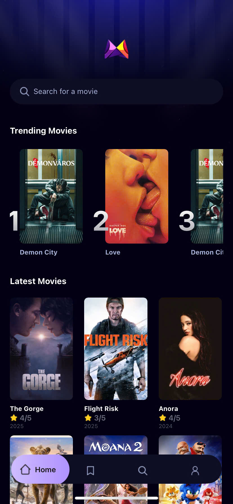
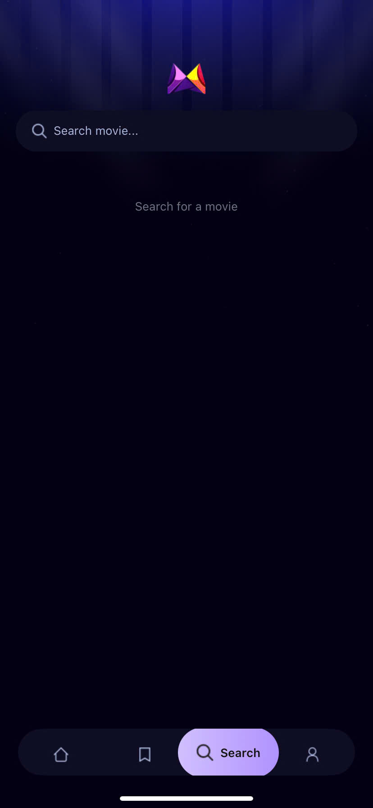
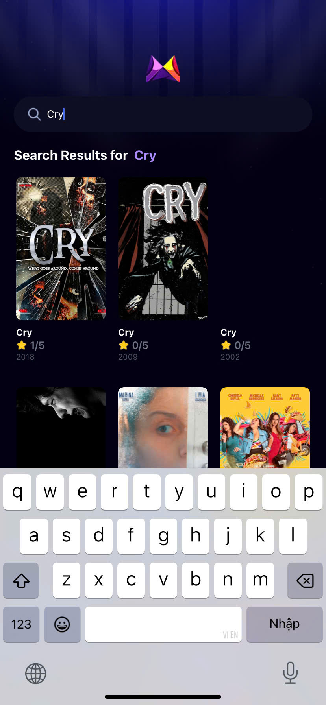

# Welcome to MovieNic App - React Native 👋

MovieNic là một ứng dụng di động phát triển bằng **React Native** (sử dụng **Expo**) giúp người dùng khám phá thông tin về phim và chương trình truyền hình. Ứng dụng tích hợp **TMDb API** để lấy dữ liệu phim và sử dụng **Appwrite** để quản lý xác thực người dùng và dữ liệu backend.

## 🚀 Công nghệ sử dụng
- **React Native (Expo)** - Framework
- **TMDb API** - Lấy dữ liệu phim, thông tin chi tiết, poster, trailer
- **Appwrite** - Quản lý người dùng, xác thực, lưu trữ dữ liệu backend
- **React Navigation** - Điều hướng giữa các màn hình
- **Axios** - Gửi request API
- **Redux (hoặc Context API)** - Quản lý trạng thái ứng dụng

## 📌 Tính năng chính
- 📽️ **Danh sách phim**: Hiển thị danh sách phim đang hot, phim mới nhất, phim thịnh hành
- 🔍 **Tìm kiếm phim**: Người dùng có thể tìm kiếm phim theo tên
- 📄 **Chi tiết phim**: Xem thông tin chi tiết về phim, diễn viên, trailer
- ❤️ **Lưu phim yêu thích**: Người dùng có thể lưu lại danh sách phim yêu thích (yêu cầu đăng nhập)
- 🔐 **Xác thực người dùng**: Đăng ký, đăng nhập bằng Appwrite Authentication
- 📋 **Quản lý tài khoản**: Cập nhật thông tin cá nhân

## 🛠️ Cài đặt và chạy dự án
### Yêu cầu
- **Node.js** >= 14
- **Expo CLI**
- **Tài khoản TMDb API & Appwrite**

### 1️⃣ Clone repository
```bash
git clone https://github.com/chaolaolo/MovieNic_ReactNative.git
cd MovieNic_ReactNative
```

### 2️⃣ Cài đặt dependencies
```bash
npm install
```

### 3️⃣ Cấu hình TMDb API & Appwrite
- Tạo tài khoản tại [TMDb](https://www.themoviedb.org/) và lấy **API Key**
- Thiết lập **Appwrite Backend** và lấy endpoint, project ID
- Tạo file `.env` trong thư mục gốc và thêm các thông tin sau:
  ```env
  TMDB_API_KEY=your_tmdb_api_key
  APPWRITE_ENDPOINT=your_appwrite_endpoint
  APPWRITE_PROJECT_ID=your_appwrite_project_id
  ```

### 4️⃣ Chạy ứng dụng
```bash
npx expo start
```
- Chạy trên thiết bị thật với **Expo Go** hoặc trên máy ảo (**Android Emulator / iOS Simulator**)

## 📸 Ảnh màn hình (Screenshots)
 <table>
  <tr>
    <td colspan="5">MovieNic Screenshots</td>
  </tr>
  <tr>
    <td></td>
    <td></td>
    <td></td>
    <td></td>
  </tr>
   <tr>
     <td colspan="5">Updating...</td>
   </tr>
</table>


## 📧 Liên hệ
- Tác giả: Chảo Láo Lở
- Nếu bạn có bất kỳ câu hỏi nào về dự án, vui lòng liên hệ với tôi qua email: [chaolaolo290604@gmail.com](mailto:chaolaolo@example.com).
